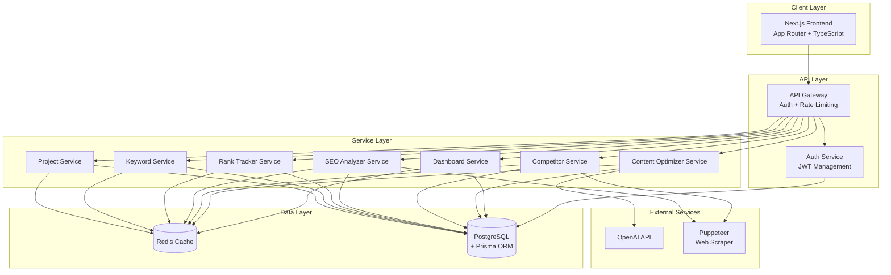
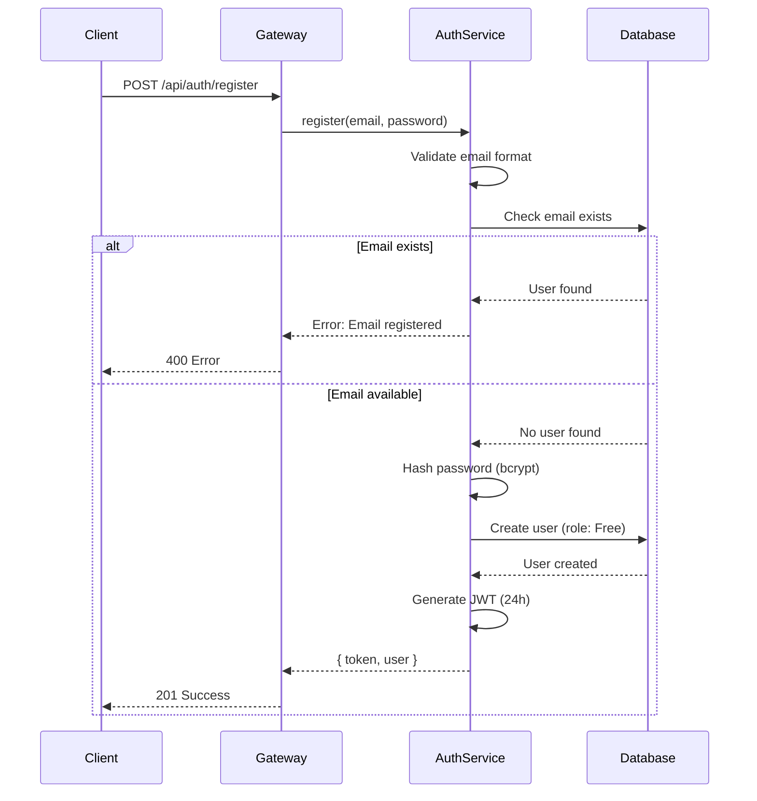
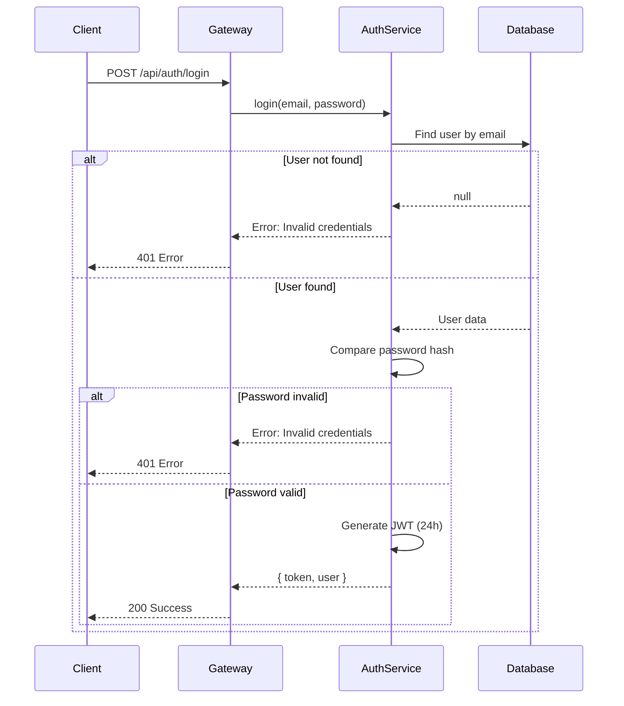
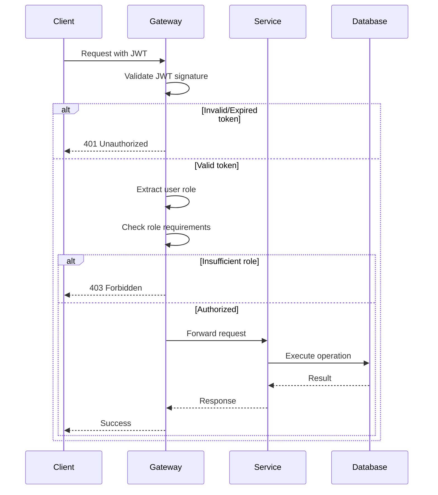

# Technical Design Document: SEO SaaS Platform

## Overview

The SEO SaaS platform is a comprehensive web application that provides keyword research, rank tracking, on-page SEO analysis, competitor analysis, and AI-powered content optimization. The system follows a modern three-tier architecture with a Next.js frontend, Node.js/Express backend, and PostgreSQL database, enhanced with Redis caching for performance.

### System Goals

- Provide real-time SEO insights and recommendations to users
- Track keyword rankings over time with historical data visualization
- Analyze competitor strategies and identify keyword opportunities
- Optimize content using AI-driven analysis against top-ranking pages
- Support multiple user roles with subscription-based feature access
- Scale efficiently to handle growing user base and data volume

### Key Design Principles

- **Separation of Concerns**: Clear boundaries between presentation, business logic, and data layers
- **Caching-First**: Aggressive caching strategy to minimize database load and API costs
- **Fail-Safe**: Graceful degradation when external services are unavailable
- **Security-First**: JWT-based authentication with role-based authorization
- **Performance**: Sub-500ms response times for dashboard queries through caching and indexing
- **Scalability**: Connection pooling, batch processing, and pagination for growth


## Architecture

### High-Level System Architecture

The platform follows a layered architecture with clear separation between frontend, backend, and data layers:



### Component Responsibilities

**Frontend (Next.js)**
- Server-side rendering for SEO and performance
- Client-side state management for interactive features
- API client with JWT token management
- Responsive UI with Tailwind CSS

**API Gateway**
- JWT token validation and user extraction
- Role-based authorization enforcement
- Rate limiting per user tier
- Request logging and error handling
- Consistent response formatting

**Auth Service**
- User registration with email validation
- Password hashing with bcrypt (10+ salt rounds)
- JWT token generation and validation (HS256, 24h expiration)
- Role assignment and management

**Service Layer**
- Business logic implementation
- Data validation and transformation
- Cache management (read-through, write-through)
- External API integration
- Transaction management

**Data Layer**
- PostgreSQL for persistent storage
- Prisma ORM for type-safe database access
- Redis for caching and rate limiting
- Connection pooling (5-20 connections)


## Components and Interfaces

### API Endpoints

#### Authentication Endpoints

**POST /api/auth/register**
```typescript
Request:
{
  email: string;      // Valid email format
  password: string;   // Minimum 8 characters
}

Response (201):
{
  success: true;
  data: {
    token: string;    // JWT token, 24h expiration
    user: {
      id: string;
      email: string;
      role: "Free" | "Pro" | "Admin";
      createdAt: string;
    }
  }
}

Error (400):
{
  success: false;
  error: "Email already registered" | "Invalid email format"
}
```

**POST /api/auth/login**
```typescript
Request:
{
  email: string;
  password: string;
}

Response (200):
{
  success: true;
  data: {
    token: string;
    user: {
      id: string;
      email: string;
      role: "Free" | "Pro" | "Admin";
    }
  }
}

Error (401):
{
  success: false;
  error: "Invalid credentials"
}
```

#### Project Endpoints

**POST /api/projects**
```typescript
Headers: { Authorization: "Bearer <token>" }

Request:
{
  domain: string;     // Valid domain format (e.g., example.com)
  name?: string;      // Optional project name
}

Response (201):
{
  success: true;
  data: {
    id: string;
    domain: string;
    name: string;
    userId: string;
    createdAt: string;
  }
}
```

**GET /api/projects**
```typescript
Headers: { Authorization: "Bearer <token>" }

Response (200):
{
  success: true;
  data: {
    projects: Array<{
      id: string;
      domain: string;
      name: string;
      keywordCount: number;
      competitorCount: number;
      lastAuditScore?: number;
      createdAt: string;
    }>;
  }
}
```

**PUT /api/projects/:id**
```typescript
Headers: { Authorization: "Bearer <token>" }

Request:
{
  domain?: string;
  name?: string;
}

Response (200):
{
  success: true;
  data: {
    id: string;
    domain: string;
    name: string;
    updatedAt: string;
  }
}
```

#### Keyword Endpoints

**POST /api/keywords/research**
```typescript
Headers: { Authorization: "Bearer <token>" }

Request:
{
  projectId: string;
  keywords: string[];  // Array of keywords to research
}

Response (200):
{
  success: true;
  data: {
    keywords: Array<{
      keyword: string;
      searchVolume: number;
      difficulty: number;      // 0-100
      cpc: number;            // USD
      lastUpdated: string;
    }>;
  }
}
```

**GET /api/keywords/:projectId**
```typescript
Headers: { Authorization: "Bearer <token>" }

Response (200):
{
  success: true;
  data: {
    keywords: Array<{
      id: string;
      keyword: string;
      searchVolume: number;
      difficulty: number;
      cpc: number;
      currentRank?: number;
      lastUpdated: string;
    }>;
  }
}
```

#### Rank Tracking Endpoints

**POST /api/rank/track**
```typescript
Headers: { Authorization: "Bearer <token>" }

Request:
{
  projectId: string;
  keyword: string;
  position: number;    // 1-100
}

Response (201):
{
  success: true;
  data: {
    id: string;
    projectId: string;
    keyword: string;
    position: number;
    date: string;       // YYYY-MM-DD
  }
}
```

**GET /api/rank/history/:projectId**
```typescript
Headers: { Authorization: "Bearer <token>" }
Query: ?keyword=<keyword>&startDate=<YYYY-MM-DD>&endDate=<YYYY-MM-DD>

Response (200):
{
  success: true;
  data: {
    rankings: Array<{
      keyword: string;
      history: Array<{
        date: string;
        position: number;
      }>;
    }>;
  }
}
```

#### SEO Audit Endpoints

**POST /api/audit**
```typescript
Headers: { Authorization: "Bearer <token>" }

Request:
{
  url: string;
  projectId?: string;  // Optional, for storing score history
}

Response (200):
{
  success: true;
  data: {
    url: string;
    score: number;      // 0-100
    analysis: {
      title: {
        content: string;
        length: number;
        optimal: boolean;
      };
      metaDescription: {
        content: string;
        length: number;
        optimal: boolean;
      };
      headings: {
        h1Count: number;
        h2Count: number;
        structure: string[];
      };
      images: {
        total: number;
        missingAlt: number;
      };
      links: {
        internal: number;
        broken: string[];
      };
    };
    recommendations: string[];
    analyzedAt: string;
  }
}
```

#### Competitor Analysis Endpoints

**POST /api/competitors/analyze**
```typescript
Headers: { Authorization: "Bearer <token>" }

Request:
{
  projectId: string;
  competitorDomain: string;
}

Response (200):
{
  success: true;
  data: {
    competitor: string;
    keywords: string[];
    overlap: {
      shared: string[];
      competitorOnly: string[];
      userOnly: string[];
    };
    lastAnalyzed: string;
  }
}
```

**GET /api/competitors/:projectId**
```typescript
Headers: { Authorization: "Bearer <token>" }

Response (200):
{
  success: true;
  data: {
    competitors: Array<{
      id: string;
      domain: string;
      keywordCount: number;
      lastAnalyzed: string;
    }>;
  }
}
```

#### Content Optimization Endpoints

**POST /api/content/score**
```typescript
Headers: { Authorization: "Bearer <token>" }
Role Required: Pro or Admin

Request:
{
  content: string;
  targetKeyword: string;
}

Response (200):
{
  success: true;
  data: {
    score: number;      // 0-100
    missingKeywords: string[];
    suggestedHeadings: string[];
    analysis: {
      keywordDensity: number;
      readabilityScore: number;
      contentLength: number;
      recommendedLength: number;
    };
  }
}
```

#### Dashboard Endpoints

**GET /api/dashboard**
```typescript
Headers: { Authorization: "Bearer <token>" }

Response (200):
{
  success: true;
  data: {
    totalKeywords: number;
    averageRank: number;
    rankChange: number;        // Percentage change
    totalProjects: number;
    recentScores: Array<{
      projectId: string;
      projectName: string;
      score: number;
      date: string;
    }>;
  }
}
```


### Service Layer Architecture

#### Auth Service

```typescript
interface AuthService {
  register(email: string, password: string): Promise<AuthResult>;
  login(email: string, password: string): Promise<AuthResult>;
  validateToken(token: string): Promise<TokenPayload>;
  hashPassword(password: string): Promise<string>;
  comparePassword(password: string, hash: string): Promise<boolean>;
}

interface AuthResult {
  token: string;
  user: {
    id: string;
    email: string;
    role: UserRole;
  };
}

interface TokenPayload {
  userId: string;
  role: UserRole;
  iat: number;
  exp: number;
}
```

**Implementation Details:**
- Uses bcrypt with salt rounds >= 10 for password hashing
- JWT tokens signed with HS256 algorithm
- Token expiration: 24 hours
- Email validation using regex pattern
- Password minimum length: 8 characters

#### Project Service

```typescript
interface ProjectService {
  create(userId: string, domain: string, name?: string): Promise<Project>;
  findByUser(userId: string): Promise<Project[]>;
  findById(projectId: string): Promise<Project | null>;
  update(projectId: string, userId: string, data: Partial<Project>): Promise<Project>;
  delete(projectId: string, userId: string): Promise<void>;
  verifyOwnership(projectId: string, userId: string): Promise<boolean>;
}
```

**Implementation Details:**
- Domain validation using URL parsing
- Ownership verification on all mutations
- Cascade delete for related keywords, rankings, competitors
- Returns enriched data with counts (keywords, competitors)

#### Keyword Service

```typescript
interface KeywordService {
  research(projectId: string, keywords: string[]): Promise<KeywordData[]>;
  findByProject(projectId: string): Promise<KeywordData[]>;
  upsert(projectId: string, keywordData: KeywordData): Promise<void>;
  invalidateCache(projectId: string): Promise<void>;
}

interface KeywordData {
  keyword: string;
  searchVolume: number;
  difficulty: number;  // 0-100
  cpc: number;        // USD
  lastUpdated: Date;
}
```

**Implementation Details:**
- Batch upsert for multiple keywords
- Cache results for 24 hours
- Invalidate cache on updates
- Mock external API for keyword metrics (or integrate real API)

#### Rank Tracker Service

```typescript
interface RankTrackerService {
  track(projectId: string, keyword: string, position: number): Promise<RankRecord>;
  getHistory(
    projectId: string,
    keyword?: string,
    startDate?: Date,
    endDate?: Date
  ): Promise<RankHistory[]>;
  calculateChange(projectId: string, keyword: string): Promise<number>;
}

interface RankRecord {
  id: string;
  projectId: string;
  keyword: string;
  position: number;
  date: string;  // YYYY-MM-DD
}

interface RankHistory {
  keyword: string;
  history: Array<{ date: string; position: number }>;
}
```

**Implementation Details:**
- Upsert logic for same keyword + date
- Cache history queries for 1 hour
- Default date range: last 30 days
- Ordered by date descending

#### SEO Analyzer Service

```typescript
interface SEOAnalyzerService {
  analyze(url: string, projectId?: string): Promise<SEOAnalysis>;
  calculateScore(analysis: SEOAnalysis): number;
  storeScore(projectId: string, score: number): Promise<void>;
  getScoreHistory(projectId: string, startDate?: Date, endDate?: Date): Promise<ScoreHistory[]>;
}

interface SEOAnalysis {
  url: string;
  score: number;
  title: TitleAnalysis;
  metaDescription: MetaAnalysis;
  headings: HeadingAnalysis;
  images: ImageAnalysis;
  links: LinkAnalysis;
  recommendations: string[];
  analyzedAt: Date;
}

interface TitleAnalysis {
  content: string;
  length: number;
  optimal: boolean;  // 50-60 characters
}

interface MetaAnalysis {
  content: string;
  length: number;
  optimal: boolean;  // 150-160 characters
}

interface HeadingAnalysis {
  h1Count: number;
  h2Count: number;
  structure: string[];
}

interface ImageAnalysis {
  total: number;
  missingAlt: number;
}

interface LinkAnalysis {
  internal: number;
  broken: string[];
}
```

**Implementation Details:**
- Uses Puppeteer for web scraping
- 30-second timeout for page load
- Scoring algorithm:
  - Title optimal: +15 points
  - Meta description optimal: +15 points
  - Single H1: +10 points
  - Multiple H2s: +10 points
  - All images have alt: +15 points
  - No broken links: +15 points
  - Internal links > 3: +10 points
  - Base score: 10 points
- Queue system for scraping (max 5 concurrent)
- Browser instance cleanup after each scrape

#### Competitor Service

```typescript
interface CompetitorService {
  analyze(projectId: string, competitorDomain: string): Promise<CompetitorAnalysis>;
  findByProject(projectId: string): Promise<Competitor[]>;
  extractKeywords(domain: string): Promise<string[]>;
  calculateOverlap(userKeywords: string[], competitorKeywords: string[]): KeywordOverlap;
}

interface CompetitorAnalysis {
  competitor: string;
  keywords: string[];
  overlap: KeywordOverlap;
  lastAnalyzed: Date;
}

interface KeywordOverlap {
  shared: string[];
  competitorOnly: string[];
  userOnly: string[];
}

interface Competitor {
  id: string;
  domain: string;
  keywordCount: number;
  lastAnalyzed: Date;
}
```

**Implementation Details:**
- Uses Puppeteer to scrape competitor pages
- Extracts keywords from meta tags, headings, content
- Cache results for 12 hours
- Stores competitor-keyword associations

#### Content Optimizer Service

```typescript
interface ContentOptimizerService {
  score(content: string, targetKeyword: string): Promise<ContentScore>;
  fetchSERPResults(keyword: string, limit: number): Promise<SERPResult[]>;
  analyzeWithAI(content: string, serpResults: SERPResult[]): Promise<AIAnalysis>;
}

interface ContentScore {
  score: number;
  missingKeywords: string[];
  suggestedHeadings: string[];
  analysis: {
    keywordDensity: number;
    readabilityScore: number;
    contentLength: number;
    recommendedLength: number;
  };
}

interface SERPResult {
  url: string;
  title: string;
  keywords: string[];
  headings: string[];
}

interface AIAnalysis {
  score: number;
  missingKeywords: string[];
  suggestedHeadings: string[];
  recommendations: string[];
}
```

**Implementation Details:**
- Fetches top 10 SERP results for target keyword
- Uses Puppeteer to extract content from SERP results
- Calls OpenAI API with prompt:
  ```
  Analyze this content for SEO optimization targeting keyword "{keyword}".
  Compare against top-ranking content.
  Provide: score (0-100), missing keywords, suggested headings.
  
  User Content: {content}
  Top Ranking Content: {serpSummary}
  ```
- Cache SERP results for 24 hours
- Rate limit OpenAI calls

#### Dashboard Service

```typescript
interface DashboardService {
  getMetrics(userId: string): Promise<DashboardMetrics>;
  calculateAverageRank(userId: string): Promise<number>;
  calculateRankChange(userId: string): Promise<number>;
}

interface DashboardMetrics {
  totalKeywords: number;
  averageRank: number;
  rankChange: number;
  totalProjects: number;
  recentScores: Array<{
    projectId: string;
    projectName: string;
    score: number;
    date: Date;
  }>;
}
```

**Implementation Details:**
- Aggregates data across all user projects
- Cache results for 5 minutes
- Rank change calculated vs previous 30-day period
- Must complete within 500ms


## Data Models

### Prisma Schema

```prisma
// schema.prisma

generator client {
  provider = "prisma-client-js"
}

datasource db {
  provider = "postgresql"
  url      = env("DATABASE_URL")
}

enum UserRole {
  Free
  Pro
  Admin
}

model User {
  id        String   @id @default(uuid())
  email     String   @unique
  password  String   // bcrypt hashed
  role      UserRole @default(Free)
  createdAt DateTime @default(now())
  updatedAt DateTime @updatedAt
  
  projects  Project[]
  
  @@index([email])
}

model Project {
  id        String   @id @default(uuid())
  domain    String
  name      String
  userId    String
  createdAt DateTime @default(now())
  updatedAt DateTime @updatedAt
  
  user        User          @relation(fields: [userId], references: [id], onDelete: Cascade)
  keywords    Keyword[]
  rankings    Ranking[]
  competitors Competitor[]
  seoScores   SEOScore[]
  
  @@index([userId])
  @@index([domain])
}

model Keyword {
  id           String   @id @default(uuid())
  projectId    String
  keyword      String
  searchVolume Int
  difficulty   Decimal  @db.Decimal(5, 2) // 0.00 to 100.00
  cpc          Decimal  @db.Decimal(10, 2) // USD
  lastUpdated  DateTime @default(now())
  
  project Project @relation(fields: [projectId], references: [id], onDelete: Cascade)
  
  @@unique([projectId, keyword])
  @@index([projectId])
  @@index([keyword])
}

model Ranking {
  id        String   @id @default(uuid())
  projectId String
  keyword   String
  position  Int      // 1-100
  date      DateTime @db.Date
  createdAt DateTime @default(now())
  
  project Project @relation(fields: [projectId], references: [id], onDelete: Cascade)
  
  @@unique([projectId, keyword, date])
  @@index([projectId])
  @@index([keyword])
  @@index([date])
}

model Competitor {
  id           String   @id @default(uuid())
  projectId    String
  domain       String
  lastAnalyzed DateTime @default(now())
  createdAt    DateTime @default(now())
  
  project          Project            @relation(fields: [projectId], references: [id], onDelete: Cascade)
  competitorKeywords CompetitorKeyword[]
  
  @@unique([projectId, domain])
  @@index([projectId])
}

model CompetitorKeyword {
  id           String @id @default(uuid())
  competitorId String
  keyword      String
  
  competitor Competitor @relation(fields: [competitorId], references: [id], onDelete: Cascade)
  
  @@unique([competitorId, keyword])
  @@index([competitorId])
  @@index([keyword])
}

model SEOScore {
  id        String   @id @default(uuid())
  projectId String
  url       String
  score     Int      // 0-100
  analysis  Json     // Stores full SEOAnalysis object
  createdAt DateTime @default(now())
  
  project Project @relation(fields: [projectId], references: [id], onDelete: Cascade)
  
  @@index([projectId])
  @@index([createdAt])
}
```

### Database Indexes Strategy

**Primary Indexes:**
- All tables have UUID primary keys
- Unique constraints on natural keys (email, projectId+keyword, etc.)

**Query Optimization Indexes:**
- `User.email`: Fast login lookups
- `Project.userId`: User's projects list
- `Keyword.projectId`: Project keywords list
- `Ranking.projectId, keyword, date`: Historical ranking queries
- `SEOScore.projectId, createdAt`: Score history queries

**Cascade Delete Strategy:**
- User deletion cascades to all projects
- Project deletion cascades to keywords, rankings, competitors, scores
- Competitor deletion cascades to competitor keywords

### Data Validation Rules

**User:**
- Email: Valid email format (RFC 5322)
- Password: Minimum 8 characters, hashed with bcrypt (salt rounds >= 10)
- Role: Enum (Free, Pro, Admin)

**Project:**
- Domain: Valid domain format (no protocol, e.g., "example.com")
- Name: 1-100 characters

**Keyword:**
- Keyword: 1-200 characters
- SearchVolume: Non-negative integer
- Difficulty: 0.00 to 100.00
- CPC: Non-negative decimal

**Ranking:**
- Position: 1 to 100
- Date: Valid date in YYYY-MM-DD format

**SEOScore:**
- Score: 0 to 100
- URL: Valid URL format


### Frontend Component Structure

#### Next.js App Router Structure

```
app/
├── (auth)/
│   ├── login/
│   │   └── page.tsx          # Login page
│   └── register/
│       └── page.tsx          # Registration page
├── (dashboard)/
│   ├── layout.tsx            # Dashboard layout with nav
│   ├── page.tsx              # Dashboard home
│   ├── projects/
│   │   ├── page.tsx          # Projects list
│   │   ├── [id]/
│   │   │   ├── page.tsx      # Project detail
│   │   │   ├── keywords/
│   │   │   │   └── page.tsx  # Keyword management
│   │   │   ├── rankings/
│   │   │   │   └── page.tsx  # Ranking history
│   │   │   └── competitors/
│   │   │       └── page.tsx  # Competitor analysis
│   │   └── new/
│   │       └── page.tsx      # Create project
│   ├── audit/
│   │   └── page.tsx          # SEO audit tool
│   └── content/
│       └── page.tsx          # Content optimizer (Pro only)
├── api/
│   └── [...all routes]/      # API routes proxy to backend
├── layout.tsx                # Root layout
└── page.tsx                  # Landing page

components/
├── auth/
│   ├── LoginForm.tsx
│   └── RegisterForm.tsx
├── dashboard/
│   ├── MetricsCard.tsx
│   ├── RankingChart.tsx
│   └── ProjectCard.tsx
├── projects/
│   ├── ProjectForm.tsx
│   ├── KeywordTable.tsx
│   └── CompetitorList.tsx
├── audit/
│   ├── AuditForm.tsx
│   └── AuditResults.tsx
├── content/
│   ├── ContentEditor.tsx
│   └── OptimizationSuggestions.tsx
└── shared/
    ├── Navbar.tsx
    ├── Sidebar.tsx
    ├── LoadingSpinner.tsx
    └── ErrorBoundary.tsx

lib/
├── api-client.ts             # API client with JWT handling
├── auth.ts                   # Auth utilities
├── hooks/
│   ├── useAuth.ts
│   ├── useProjects.ts
│   └── useKeywords.ts
└── types/
    └── api.ts                # TypeScript types for API

```

#### Key Frontend Components

**API Client**
```typescript
// lib/api-client.ts
class APIClient {
  private baseURL: string;
  private token: string | null;

  constructor() {
    this.baseURL = process.env.NEXT_PUBLIC_API_URL || 'http://localhost:3001';
    this.token = null;
  }

  setToken(token: string) {
    this.token = token;
    localStorage.setItem('token', token);
  }

  async request<T>(endpoint: string, options?: RequestInit): Promise<T> {
    const headers = {
      'Content-Type': 'application/json',
      ...(this.token && { Authorization: `Bearer ${this.token}` }),
      ...options?.headers,
    };

    const response = await fetch(`${this.baseURL}${endpoint}`, {
      ...options,
      headers,
    });

    const data = await response.json();

    if (!data.success) {
      throw new Error(data.error);
    }

    return data.data;
  }
}
```

**Auth Hook**
```typescript
// lib/hooks/useAuth.ts
export function useAuth() {
  const [user, setUser] = useState<User | null>(null);
  const [loading, setLoading] = useState(true);

  useEffect(() => {
    const token = localStorage.getItem('token');
    if (token) {
      // Validate token and load user
      apiClient.setToken(token);
      loadUser();
    } else {
      setLoading(false);
    }
  }, []);

  const login = async (email: string, password: string) => {
    const data = await apiClient.request('/api/auth/login', {
      method: 'POST',
      body: JSON.stringify({ email, password }),
    });
    apiClient.setToken(data.token);
    setUser(data.user);
  };

  const logout = () => {
    localStorage.removeItem('token');
    setUser(null);
  };

  return { user, loading, login, logout };
}
```

**Protected Route Middleware**
```typescript
// middleware.ts
export function middleware(request: NextRequest) {
  const token = request.cookies.get('token')?.value;
  
  if (!token && request.nextUrl.pathname.startsWith('/dashboard')) {
    return NextResponse.redirect(new URL('/login', request.url));
  }
  
  return NextResponse.next();
}
```


### Caching Strategy Implementation

#### Cache Layer Architecture

```typescript
// lib/cache.ts
interface CacheService {
  get<T>(key: string): Promise<T | null>;
  set(key: string, value: any, ttl: number): Promise<void>;
  del(key: string): Promise<void>;
  delPattern(pattern: string): Promise<void>;
}

class RedisCache implements CacheService {
  private client: Redis;

  constructor(url: string) {
    this.client = new Redis(url);
  }

  async get<T>(key: string): Promise<T | null> {
    const value = await this.client.get(key);
    return value ? JSON.parse(value) : null;
  }

  async set(key: string, value: any, ttl: number): Promise<void> {
    await this.client.setex(key, ttl, JSON.stringify(value));
  }

  async del(key: string): Promise<void> {
    await this.client.del(key);
  }

  async delPattern(pattern: string): Promise<void> {
    const keys = await this.client.keys(pattern);
    if (keys.length > 0) {
      await this.client.del(...keys);
    }
  }
}
```

#### Cache Key Patterns

```typescript
const CacheKeys = {
  // Keyword data: 24 hour TTL
  keywords: (projectId: string) => `keywords:${projectId}`,
  
  // Ranking history: 1 hour TTL
  rankings: (projectId: string, keyword?: string) => 
    keyword ? `rankings:${projectId}:${keyword}` : `rankings:${projectId}`,
  
  // Competitor analysis: 12 hour TTL
  competitor: (projectId: string, domain: string) => 
    `competitor:${projectId}:${domain}`,
  
  // Dashboard metrics: 5 minute TTL
  dashboard: (userId: string) => `dashboard:${userId}`,
  
  // SERP results: 24 hour TTL
  serp: (keyword: string) => `serp:${keyword}`,
  
  // Rate limiting: 1 hour TTL
  rateLimit: (userId: string) => `ratelimit:${userId}`,
};

const CacheTTL = {
  KEYWORDS: 86400,      // 24 hours
  RANKINGS: 3600,       // 1 hour
  COMPETITOR: 43200,    // 12 hours
  DASHBOARD: 300,       // 5 minutes
  SERP: 86400,          // 24 hours
  RATE_LIMIT: 3600,     // 1 hour
};
```

#### Cache Invalidation Strategy

**Write-Through Pattern:**
```typescript
async function updateKeyword(projectId: string, keywordData: KeywordData) {
  // Update database
  await prisma.keyword.upsert({
    where: { projectId_keyword: { projectId, keyword: keywordData.keyword } },
    update: keywordData,
    create: { projectId, ...keywordData },
  });
  
  // Invalidate cache
  await cache.del(CacheKeys.keywords(projectId));
}
```

**Read-Through Pattern:**
```typescript
async function getKeywords(projectId: string): Promise<KeywordData[]> {
  // Try cache first
  const cached = await cache.get<KeywordData[]>(CacheKeys.keywords(projectId));
  if (cached) return cached;
  
  // Fetch from database
  const keywords = await prisma.keyword.findMany({
    where: { projectId },
  });
  
  // Store in cache
  await cache.set(CacheKeys.keywords(projectId), keywords, CacheTTL.KEYWORDS);
  
  return keywords;
}
```

**Cascade Invalidation:**
```typescript
async function deleteProject(projectId: string, userId: string) {
  // Delete from database (cascades to related records)
  await prisma.project.delete({
    where: { id: projectId, userId },
  });
  
  // Invalidate all related caches
  await cache.delPattern(`keywords:${projectId}*`);
  await cache.delPattern(`rankings:${projectId}*`);
  await cache.delPattern(`competitor:${projectId}*`);
  await cache.del(CacheKeys.dashboard(userId));
}
```

#### Rate Limiting Implementation

```typescript
interface RateLimiter {
  checkLimit(userId: string, role: UserRole): Promise<boolean>;
  increment(userId: string): Promise<void>;
}

class RedisRateLimiter implements RateLimiter {
  private limits = {
    Free: 100,
    Pro: 1000,
    Admin: Infinity,
  };

  async checkLimit(userId: string, role: UserRole): Promise<boolean> {
    if (role === 'Admin') return true;
    
    const key = CacheKeys.rateLimit(userId);
    const count = await cache.get<number>(key) || 0;
    
    return count < this.limits[role];
  }

  async increment(userId: string): Promise<void> {
    const key = CacheKeys.rateLimit(userId);
    const count = await cache.get<number>(key) || 0;
    await cache.set(key, count + 1, CacheTTL.RATE_LIMIT);
  }
}
```

### Authentication and Authorization Flow

#### Registration Flow



#### Authentication Flow



#### Authorization Flow




## Correctness Properties

*A property is a characteristic or behavior that should hold true across all valid executions of a system—essentially, a formal statement about what the system should do. Properties serve as the bridge between human-readable specifications and machine-verifiable correctness guarantees.*

### Property Reflection

After analyzing all acceptance criteria, several redundancies were identified:

- JWT token expiration (1.6 and 2.4) can be combined into a single property
- Multiple properties about response structure (19.1-19.4) can be consolidated
- HTTP status code properties (14.2-14.5, 19.6-19.7) can be combined
- Cache TTL properties (15.1-15.4) follow the same pattern and can be generalized
- Sort order properties (6.5, 11.4, 12.2) follow the same pattern
- Date range filtering (6.6, 11.2, 12.3) can be combined
- Round-trip properties for data storage (1.5, 4.2, 5.2, 6.2, 8.3, 8.6, 12.1) follow the same pattern

The following properties represent the unique, non-redundant validation requirements:

### Property 1: Email Format Validation

*For any* string input to the registration endpoint, the Auth_Service should correctly identify whether it matches valid email format (RFC 5322) and reject invalid formats.

**Validates: Requirements 1.1**

### Property 2: Duplicate Email Detection

*For any* email that has already been registered, attempting to register the same email again should return an error indicating the email is already registered.

**Validates: Requirements 1.2**

### Property 3: Password Hashing Security

*For any* password provided during registration, the stored hash should be generated using bcrypt with salt rounds >= 10, and the original password should never be stored in plain text.

**Validates: Requirements 1.3**

### Property 4: Default Role Assignment

*For any* new user registration, the created user should have the role set to "Free" by default.

**Validates: Requirements 1.4**

### Property 5: Registration Round-Trip

*For any* valid registration data (email and password), after successful registration, querying the database for that email should return a user record with matching email and verifiable password hash.

**Validates: Requirements 1.5**

### Property 6: JWT Token Expiration

*For any* JWT token generated by the Auth_Service (during registration or login), the token's expiration time should be exactly 24 hours from the creation time.

**Validates: Requirements 1.6, 2.4**

### Property 7: Login Credential Validation

*For any* login attempt, the Auth_Service should return success if and only if both the email exists in the database and the provided password matches the stored hash.

**Validates: Requirements 2.1**

### Property 8: JWT Token Structure

*For any* valid authentication (registration or login), the generated JWT token should contain userId and role in the payload and use HS256 algorithm for signing.

**Validates: Requirements 2.3, 2.5**

### Property 9: Authentication Response Completeness

*For any* successful authentication, the response should include both a valid JWT token and complete user profile data (id, email, role).

**Validates: Requirements 2.6**

### Property 10: JWT Signature Validation

*For any* JWT token, the API_Gateway should accept tokens with valid signatures and reject tokens with invalid or missing signatures.

**Validates: Requirements 3.1**

### Property 11: Role Extraction from Token

*For any* valid JWT token, the API_Gateway should correctly extract the user role from the token payload.

**Validates: Requirements 3.3**

### Property 12: Role-Based Access Control

*For any* endpoint with role requirements, the API_Gateway should deny access to users whose role is insufficient (Free cannot access Pro features, Free and Pro cannot access Admin features) and return HTTP 403.

**Validates: Requirements 3.4, 3.5, 3.6**

### Property 13: Domain Format Validation

*For any* project creation request, the Platform should validate that the domain follows valid domain format (e.g., "example.com" without protocol) and reject invalid formats.

**Validates: Requirements 4.1**

### Property 14: Project Storage Round-Trip

*For any* valid project creation request, after creating the project, querying the database should return a project with matching domain, user ID, and a creation timestamp.

**Validates: Requirements 4.2**

### Property 15: Multiple Projects Per User

*For any* user, creating multiple projects should result in all projects being associated with that user's ID and retrievable via user project queries.

**Validates: Requirements 4.3**

### Property 16: New Project Initialization

*For any* newly created project, the keywords and competitors collections should be empty (zero count).

**Validates: Requirements 4.4**

### Property 17: Project Data Isolation

*For any* user, querying their projects should return only projects where the userId matches their ID, never returning projects owned by other users.

**Validates: Requirements 4.5**

### Property 18: Project Ownership Verification

*For any* project update or delete request, the operation should succeed only if the requesting user's ID matches the project's userId, otherwise returning an authorization error.

**Validates: Requirements 4.6**

### Property 19: Keyword Data Round-Trip

*For any* keyword research data (keyword, searchVolume, difficulty, cpc), after storing it for a project, retrieving keywords for that project should return data with all fields matching the stored values.

**Validates: Requirements 5.2**

### Property 20: Keyword Upsert Behavior

*For any* keyword that already exists for a project (same projectId and keyword), storing new data should update the existing record rather than creating a duplicate.

**Validates: Requirements 5.3**

### Property 21: Keyword Data Type Constraints

*For any* stored keyword, searchVolume should be an integer, difficulty should be a decimal between 0 and 100, and cpc should be a non-negative decimal.

**Validates: Requirements 5.4, 5.5, 5.6**

### Property 22: Keyword Timestamp Generation

*For any* keyword data storage operation, the lastUpdated field should be set to the current timestamp.

**Validates: Requirements 5.7**

### Property 23: Ranking Data Round-Trip

*For any* ranking record (projectId, keyword, position, date), after storing it, querying rankings for that project and keyword should return a record with matching values.

**Validates: Requirements 6.2**

### Property 24: Ranking Position Constraints

*For any* stored ranking, the position value should be an integer between 1 and 100 (inclusive).

**Validates: Requirements 6.3**

### Property 25: Ranking Upsert Behavior

*For any* ranking with the same projectId, keyword, and date, storing new position data should update the existing record rather than creating a duplicate.

**Validates: Requirements 6.4**

### Property 26: Ranking History Sort Order

*For any* ranking history query, the results should be ordered by date in descending order (most recent first).

**Validates: Requirements 6.5, 11.4, 12.2**

### Property 27: Date Range Filtering

*For any* query that supports date range filtering (rankings, SEO scores), providing startDate and endDate parameters should return only records where the date falls within that range (inclusive).

**Validates: Requirements 6.6, 11.2, 12.3**

### Property 28: Ranking Date Format

*For any* stored ranking, the date field should be in YYYY-MM-DD format.

**Validates: Requirements 6.7**

### Property 29: SEO Analysis Element Extraction

*For any* web page URL, the SEO_Analyzer should extract and return all required elements: title tag, meta description, H1/H2 counts, images with/without alt attributes, internal link count, and broken links.

**Validates: Requirements 7.2, 7.3, 7.4, 7.5, 7.6, 7.7**

### Property 30: SEO Score Range

*For any* SEO analysis or content optimization, the calculated score should be an integer between 0 and 100 (inclusive).

**Validates: Requirements 7.8, 9.5**

### Property 31: SEO Analysis Response Completeness

*For any* completed SEO analysis, the response should include the score and structured analysis data for all evaluated elements (title, meta, headings, images, links).

**Validates: Requirements 7.9**

### Property 32: Competitor Keyword Extraction

*For any* competitor domain analysis, the Platform should extract keywords from the competitor's pages and store the association between competitor ID and keywords.

**Validates: Requirements 8.2, 8.3**

### Property 33: Keyword Overlap Calculation

*For any* project with keywords K1 and competitor with keywords K2, the overlap calculation should correctly identify: shared keywords (K1 ∩ K2), competitor-only keywords (K2 - K1), and user-only keywords (K1 - K2).

**Validates: Requirements 8.4, 8.5**

### Property 34: Competitor Data Round-Trip

*For any* competitor analysis, after storing the competitor domain and lastAnalyzed timestamp, querying competitors for that project should return the stored data.

**Validates: Requirements 8.6, 8.7**

### Property 35: SERP Results Retrieval

*For any* content optimization request, the Content_Optimizer should retrieve exactly 10 SERP results for the target keyword and extract keywords and headings from each result.

**Validates: Requirements 9.2, 9.3**

### Property 36: Content Optimization Response Structure

*For any* completed content analysis, the response should include score (0-100), missing keywords list, suggested headings list, and analysis metrics (keyword density, readability, content length, recommended length).

**Validates: Requirements 9.6, 9.7, 9.8**

### Property 37: Dashboard Metrics Aggregation

*For any* user with N projects containing M total keywords and R rankings, the dashboard should return: totalKeywords = M, totalProjects = N, averageRank = mean of all current positions, and rankChange = percentage change vs previous period.

**Validates: Requirements 10.1, 10.2, 10.3, 10.4**

### Property 38: Dashboard Recent Scores

*For any* user's projects, the dashboard should return the most recent SEO score for each project (highest timestamp).

**Validates: Requirements 10.5**

### Property 39: Cache TTL Configuration

*For any* cached data, the TTL should match the specified duration: keywords (24h), rankings (1h), competitors (12h), dashboard (5min), SERP results (24h), rate limits (1h).

**Validates: Requirements 10.7, 11.6, 15.1, 15.2, 15.3, 15.4**

### Property 40: Ranking History Response Format

*For any* ranking graph data request, the response should be formatted as an array of keywords, each containing a history array of {date, position} pairs.

**Validates: Requirements 11.5**

### Property 41: SEO Score Storage Round-Trip

*For any* completed SEO audit with projectId, after storing the score and timestamp, querying score history for that project should return a record with matching score and timestamp.

**Validates: Requirements 12.1**

### Property 42: Score Change Calculation

*For any* SEO score history with at least 2 audits, the score change percentage should be calculated as ((current - previous) / previous) * 100.

**Validates: Requirements 12.4**

### Property 43: Rate Limit Tracking

*For any* user making API requests, the API_Gateway should increment the request counter in cache and enforce limits: Free (100/hour), Pro (1000/hour), Admin (unlimited).

**Validates: Requirements 13.1, 13.2, 13.3, 13.4**

### Property 44: Rate Limit Response

*For any* request that exceeds the rate limit, the API_Gateway should return HTTP 429 with a Retry-After header indicating seconds until the limit resets.

**Validates: Requirements 13.5, 13.6**

### Property 45: Rate Limit Cache Storage

*For any* rate limit counter, it should be stored in the Cache_Layer with TTL matching the time window (1 hour).

**Validates: Requirements 13.7**

### Property 46: Error Logging Completeness

*For any* error occurring in any subsystem, the Platform should log the error with timestamp, user ID (if available), endpoint, error message, and severity level.

**Validates: Requirements 14.1, 14.7**

### Property 47: HTTP Status Code Mapping

*For any* API response, the HTTP status code should match the error type: 400 (validation), 401 (authentication), 403 (authorization), 404 (not found), 500 (internal error), 2xx (success).

**Validates: Requirements 14.2, 14.3, 14.4, 14.5, 19.6, 19.7**

### Property 48: Internal Error Security

*For any* internal server error (500), the response should not expose internal implementation details, stack traces, or sensitive information.

**Validates: Requirements 14.6**

### Property 49: External API Error Handling

*For any* external API call failure (OpenAI, web scraping), the Platform should log the failure with details and return a user-friendly error message without exposing internal error details.

**Validates: Requirements 14.8**

### Property 50: Cache Invalidation on Update

*For any* database update operation, the Platform should invalidate all corresponding cache entries to prevent stale data.

**Validates: Requirements 15.5**

### Property 51: Cache Failure Graceful Degradation

*For any* cache retrieval failure, the Platform should fall back to fetching data from the Database and continue operation without error.

**Validates: Requirements 15.7**

### Property 52: Scraping Timeout Enforcement

*For any* web scraping operation, if the page does not load within 30 seconds, the Platform should abort the operation and return an error indicating the page is unreachable.

**Validates: Requirements 16.2**

### Property 53: JavaScript Rendering Completion

*For any* scraped URL, the Platform should extract HTML content only after JavaScript execution completes, ensuring dynamic content is captured.

**Validates: Requirements 16.4**

### Property 54: Browser Resource Cleanup

*For any* completed scraping operation (success or failure), the Platform should close the browser instance to free system resources.

**Validates: Requirements 16.5**

### Property 55: Scraping Concurrency Limit

*For any* set of concurrent scraping requests, the Platform should limit execution to maximum 5 simultaneous operations, queuing additional requests.

**Validates: Requirements 16.6, 16.7**

### Property 56: Foreign Key Constraint Enforcement

*For any* attempt to create a record with a foreign key reference to a non-existent record, the Database should reject the operation with a constraint violation error.

**Validates: Requirements 17.3**

### Property 57: Cascade Delete Behavior

*For any* user deletion, the Database should automatically delete all associated projects, and for each project deletion, automatically delete all associated keywords, rankings, competitors, and SEO scores.

**Validates: Requirements 17.5**

### Property 58: UTC Timestamp Storage

*For any* timestamp stored in the Database, it should be in UTC timezone regardless of the server's local timezone.

**Validates: Requirements 17.6**

### Property 59: Unique Constraint Enforcement

*For any* attempt to create a duplicate record violating unique constraints (email in users, projectId+keyword in keywords), the Database should reject the operation.

**Validates: Requirements 17.7**

### Property 60: Environment Variable Validation

*For any* required environment variable (DATABASE_URL, REDIS_URL, JWT_SECRET, OPENAI_API_KEY), if it is missing at startup, the Platform should fail to start and log the missing variable name.

**Validates: Requirements 18.6**

### Property 61: API Response Format Consistency

*For any* API response, it should follow the standard format: success responses include {success: true, data: {...}}, error responses include {success: false, error: "message"}, and Content-Type should be application/json.

**Validates: Requirements 19.1, 19.2, 19.3, 19.4, 19.5**

### Property 62: Batch Processing Size Limit

*For any* bulk operation processing multiple records, the Platform should process them in batches with maximum batch size of 100 records.

**Validates: Requirements 20.3**

### Property 63: Pagination Configuration

*For any* list endpoint, the Platform should implement pagination with default page size of 50, maximum page size of 100, and include metadata (total count, page number, page size) in responses.

**Validates: Requirements 20.4, 20.5**

### Property 64: Transaction Atomicity

*For any* operation that modifies multiple related records, the Platform should use database transactions to ensure all changes succeed or all fail together (atomicity).

**Validates: Requirements 20.6**

### Property 65: Graceful Shutdown

*For any* shutdown signal received by the Platform, it should stop accepting new requests, complete all in-flight requests, close database and cache connections, and then terminate.

**Validates: Requirements 20.7**


## Error Handling

### Error Classification

The platform implements a hierarchical error handling strategy with clear error types and consistent responses:

```typescript
// lib/errors.ts
export class AppError extends Error {
  constructor(
    public statusCode: number,
    public message: string,
    public isOperational: boolean = true
  ) {
    super(message);
    Object.setPrototypeOf(this, AppError.prototype);
  }
}

export class ValidationError extends AppError {
  constructor(message: string) {
    super(400, message);
  }
}

export class AuthenticationError extends AppError {
  constructor(message: string = 'Invalid credentials') {
    super(401, message);
  }
}

export class AuthorizationError extends AppError {
  constructor(message: string = 'Insufficient permissions') {
    super(403, message);
  }
}

export class NotFoundError extends AppError {
  constructor(resource: string) {
    super(404, `${resource} not found`);
  }
}

export class RateLimitError extends AppError {
  constructor(public retryAfter: number) {
    super(429, 'Rate limit exceeded');
  }
}

export class ExternalServiceError extends AppError {
  constructor(service: string, message: string) {
    super(502, `${service} service error: ${message}`);
  }
}
```

### Global Error Handler

```typescript
// middleware/errorHandler.ts
export function errorHandler(
  err: Error,
  req: Request,
  res: Response,
  next: NextFunction
) {
  // Log all errors
  logger.error({
    timestamp: new Date().toISOString(),
    userId: req.user?.id,
    endpoint: req.path,
    method: req.method,
    error: err.message,
    stack: err.stack,
    severity: err instanceof AppError ? 'warning' : 'error',
  });

  // Handle known operational errors
  if (err instanceof AppError && err.isOperational) {
    if (err instanceof RateLimitError) {
      return res
        .status(err.statusCode)
        .header('Retry-After', err.retryAfter.toString())
        .json({
          success: false,
          error: err.message,
        });
    }

    return res.status(err.statusCode).json({
      success: false,
      error: err.message,
    });
  }

  // Handle unknown/programming errors
  // Don't expose internal details
  res.status(500).json({
    success: false,
    error: 'An unexpected error occurred',
  });
}
```

### Service-Level Error Handling

**Database Errors:**
```typescript
try {
  const user = await prisma.user.create({ data: userData });
  return user;
} catch (error) {
  if (error.code === 'P2002') {
    // Unique constraint violation
    throw new ValidationError('Email already registered');
  }
  if (error.code === 'P2003') {
    // Foreign key constraint violation
    throw new ValidationError('Referenced record does not exist');
  }
  throw error; // Re-throw unknown errors
}
```

**Cache Errors:**
```typescript
async function getCachedData<T>(key: string, fallback: () => Promise<T>): Promise<T> {
  try {
    const cached = await cache.get<T>(key);
    if (cached) return cached;
  } catch (error) {
    logger.warn(`Cache retrieval failed for key ${key}:`, error);
    // Continue to fallback
  }
  
  // Fetch from database
  const data = await fallback();
  
  // Try to cache, but don't fail if caching fails
  try {
    await cache.set(key, data, ttl);
  } catch (error) {
    logger.warn(`Cache storage failed for key ${key}:`, error);
  }
  
  return data;
}
```

**External API Errors:**
```typescript
async function callOpenAI(prompt: string): Promise<string> {
  try {
    const response = await openai.createCompletion({
      model: 'gpt-4',
      prompt,
      max_tokens: 500,
    });
    return response.data.choices[0].text;
  } catch (error) {
    logger.error('OpenAI API call failed:', error);
    throw new ExternalServiceError(
      'OpenAI',
      'Content analysis temporarily unavailable'
    );
  }
}
```

**Web Scraping Errors:**
```typescript
async function scrapePage(url: string): Promise<string> {
  let browser;
  try {
    browser = await puppeteer.launch();
    const page = await browser.newPage();
    
    await page.goto(url, {
      timeout: 30000,
      waitUntil: 'networkidle0',
    });
    
    const html = await page.content();
    return html;
  } catch (error) {
    if (error.name === 'TimeoutError') {
      throw new ValidationError('Page unreachable or took too long to load');
    }
    logger.error(`Scraping failed for ${url}:`, error);
    throw new ExternalServiceError('Scraper', 'Failed to fetch page content');
  } finally {
    if (browser) {
      await browser.close();
    }
  }
}
```

### Logging Strategy

**Structured Logging with Winston:**
```typescript
// lib/logger.ts
import winston from 'winston';

export const logger = winston.createLogger({
  level: process.env.LOG_LEVEL || 'info',
  format: winston.format.combine(
    winston.format.timestamp(),
    winston.format.errors({ stack: true }),
    winston.format.json()
  ),
  transports: [
    new winston.transports.File({
      filename: 'logs/error.log',
      level: 'error',
    }),
    new winston.transports.File({
      filename: 'logs/combined.log',
    }),
  ],
});

if (process.env.NODE_ENV !== 'production') {
  logger.add(
    new winston.transports.Console({
      format: winston.format.combine(
        winston.format.colorize(),
        winston.format.simple()
      ),
    })
  );
}
```

**Log Levels:**
- `error`: System errors, external service failures, unhandled exceptions
- `warn`: Cache failures, rate limit hits, validation failures
- `info`: Successful operations, authentication events, important state changes
- `debug`: Detailed operation traces, query execution (development only)


## Testing Strategy

### Dual Testing Approach

The platform requires comprehensive test coverage using both unit tests and property-based tests:

**Unit Tests:**
- Specific examples demonstrating correct behavior
- Edge cases and boundary conditions
- Integration points between components
- Error conditions and exception handling
- Mock external dependencies (OpenAI, Puppeteer)

**Property-Based Tests:**
- Universal properties that hold for all inputs
- Comprehensive input coverage through randomization
- Minimum 100 iterations per property test
- Each test references its design document property

### Property-Based Testing Configuration

**Library Selection:**
- **JavaScript/TypeScript**: Use `fast-check` library
- Provides generators for common types and custom data structures
- Supports async property testing for database operations
- Integrates with Jest/Vitest test runners

**Test Configuration:**
```typescript
// vitest.config.ts
export default defineConfig({
  test: {
    globals: true,
    environment: 'node',
    setupFiles: ['./tests/setup.ts'],
    coverage: {
      provider: 'v8',
      reporter: ['text', 'json', 'html'],
      exclude: ['node_modules/', 'tests/'],
    },
  },
});
```

**Property Test Template:**
```typescript
import fc from 'fast-check';
import { describe, it, expect } from 'vitest';

describe('Feature: seo-saas-platform, Property 1: Email Format Validation', () => {
  it('should correctly validate email format for all inputs', async () => {
    await fc.assert(
      fc.asyncProperty(
        fc.emailAddress(),
        async (email) => {
          const result = await authService.validateEmail(email);
          expect(result).toBe(true);
        }
      ),
      { numRuns: 100 }
    );

    await fc.assert(
      fc.asyncProperty(
        fc.string().filter(s => !s.includes('@')),
        async (invalidEmail) => {
          const result = await authService.validateEmail(invalidEmail);
          expect(result).toBe(false);
        }
      ),
      { numRuns: 100 }
    );
  });
});
```

### Test Organization

```
tests/
├── unit/
│   ├── auth/
│   │   ├── auth.service.test.ts
│   │   ├── jwt.test.ts
│   │   └── password.test.ts
│   ├── projects/
│   │   ├── project.service.test.ts
│   │   └── validation.test.ts
│   ├── keywords/
│   │   └── keyword.service.test.ts
│   ├── rankings/
│   │   └── rank-tracker.service.test.ts
│   ├── seo/
│   │   ├── analyzer.service.test.ts
│   │   └── scoring.test.ts
│   ├── competitors/
│   │   └── competitor.service.test.ts
│   ├── content/
│   │   └── optimizer.service.test.ts
│   └── dashboard/
│       └── dashboard.service.test.ts
├── property/
│   ├── auth.properties.test.ts
│   ├── projects.properties.test.ts
│   ├── keywords.properties.test.ts
│   ├── rankings.properties.test.ts
│   ├── seo.properties.test.ts
│   ├── competitors.properties.test.ts
│   ├── content.properties.test.ts
│   ├── api.properties.test.ts
│   └── database.properties.test.ts
├── integration/
│   ├── api/
│   │   ├── auth.integration.test.ts
│   │   ├── projects.integration.test.ts
│   │   └── keywords.integration.test.ts
│   └── database/
│       └── migrations.test.ts
├── e2e/
│   ├── user-flows.test.ts
│   └── dashboard.test.ts
├── fixtures/
│   ├── users.ts
│   ├── projects.ts
│   └── keywords.ts
├── helpers/
│   ├── test-db.ts
│   ├── test-cache.ts
│   └── generators.ts
└── setup.ts
```

### Custom Generators for Property Tests

```typescript
// tests/helpers/generators.ts
import fc from 'fast-check';

export const userArbitrary = fc.record({
  email: fc.emailAddress(),
  password: fc.string({ minLength: 8, maxLength: 50 }),
  role: fc.constantFrom('Free', 'Pro', 'Admin'),
});

export const projectArbitrary = fc.record({
  domain: fc.domain(),
  name: fc.string({ minLength: 1, maxLength: 100 }),
});

export const keywordArbitrary = fc.record({
  keyword: fc.string({ minLength: 1, maxLength: 200 }),
  searchVolume: fc.nat(),
  difficulty: fc.float({ min: 0, max: 100 }),
  cpc: fc.float({ min: 0, max: 1000 }),
});

export const rankingArbitrary = fc.record({
  keyword: fc.string({ minLength: 1, maxLength: 200 }),
  position: fc.integer({ min: 1, max: 100 }),
  date: fc.date().map(d => d.toISOString().split('T')[0]),
});

export const seoScoreArbitrary = fc.integer({ min: 0, max: 100 });
```

### Example Property Tests

**Property 5: Registration Round-Trip**
```typescript
// Feature: seo-saas-platform, Property 5: Registration Round-Trip
describe('Registration Round-Trip', () => {
  it('should store and retrieve user data correctly', async () => {
    await fc.assert(
      fc.asyncProperty(
        fc.emailAddress(),
        fc.string({ minLength: 8 }),
        async (email, password) => {
          // Register user
          const { user } = await authService.register(email, password);
          
          // Query database
          const stored = await prisma.user.findUnique({
            where: { email },
          });
          
          // Verify data
          expect(stored).toBeDefined();
          expect(stored.email).toBe(email);
          expect(await bcrypt.compare(password, stored.password)).toBe(true);
          
          // Cleanup
          await prisma.user.delete({ where: { id: user.id } });
        }
      ),
      { numRuns: 100 }
    );
  });
});
```

**Property 20: Keyword Upsert Behavior**
```typescript
// Feature: seo-saas-platform, Property 20: Keyword Upsert Behavior
describe('Keyword Upsert', () => {
  it('should update existing keywords instead of creating duplicates', async () => {
    await fc.assert(
      fc.asyncProperty(
        keywordArbitrary,
        keywordArbitrary,
        async (initial, updated) => {
          const project = await createTestProject();
          
          // Store initial keyword
          await keywordService.upsert(project.id, {
            ...initial,
            keyword: 'test-keyword',
          });
          
          // Store updated keyword with same name
          await keywordService.upsert(project.id, {
            ...updated,
            keyword: 'test-keyword',
          });
          
          // Verify only one record exists
          const keywords = await prisma.keyword.findMany({
            where: { projectId: project.id, keyword: 'test-keyword' },
          });
          
          expect(keywords).toHaveLength(1);
          expect(keywords[0].searchVolume).toBe(updated.searchVolume);
          
          // Cleanup
          await cleanupTestProject(project.id);
        }
      ),
      { numRuns: 100 }
    );
  });
});
```

**Property 33: Keyword Overlap Calculation**
```typescript
// Feature: seo-saas-platform, Property 33: Keyword Overlap Calculation
describe('Keyword Overlap', () => {
  it('should correctly calculate set operations', async () => {
    await fc.assert(
      fc.asyncProperty(
        fc.array(fc.string(), { minLength: 1, maxLength: 20 }),
        fc.array(fc.string(), { minLength: 1, maxLength: 20 }),
        async (userKeywords, competitorKeywords) => {
          const overlap = competitorService.calculateOverlap(
            userKeywords,
            competitorKeywords
          );
          
          // Verify shared keywords (intersection)
          const expectedShared = userKeywords.filter(k =>
            competitorKeywords.includes(k)
          );
          expect(overlap.shared.sort()).toEqual(expectedShared.sort());
          
          // Verify competitor-only (difference)
          const expectedCompOnly = competitorKeywords.filter(
            k => !userKeywords.includes(k)
          );
          expect(overlap.competitorOnly.sort()).toEqual(expectedCompOnly.sort());
          
          // Verify user-only (difference)
          const expectedUserOnly = userKeywords.filter(
            k => !competitorKeywords.includes(k)
          );
          expect(overlap.userOnly.sort()).toEqual(expectedUserOnly.sort());
        }
      ),
      { numRuns: 100 }
    );
  });
});
```

**Property 57: Cascade Delete Behavior**
```typescript
// Feature: seo-saas-platform, Property 57: Cascade Delete Behavior
describe('Cascade Delete', () => {
  it('should delete all related records when user is deleted', async () => {
    await fc.assert(
      fc.asyncProperty(
        fc.nat({ max: 5 }),
        fc.nat({ max: 10 }),
        async (projectCount, keywordCount) => {
          // Create user with projects and keywords
          const user = await createTestUser();
          const projects = await Promise.all(
            Array(projectCount).fill(0).map(() => 
              createTestProject(user.id)
            )
          );
          
          for (const project of projects) {
            await Promise.all(
              Array(keywordCount).fill(0).map(() =>
                createTestKeyword(project.id)
              )
            );
          }
          
          // Delete user
          await prisma.user.delete({ where: { id: user.id } });
          
          // Verify all related data is deleted
          const remainingProjects = await prisma.project.findMany({
            where: { userId: user.id },
          });
          expect(remainingProjects).toHaveLength(0);
          
          const remainingKeywords = await prisma.keyword.findMany({
            where: { projectId: { in: projects.map(p => p.id) } },
          });
          expect(remainingKeywords).toHaveLength(0);
        }
      ),
      { numRuns: 100 }
    );
  });
});
```

### Unit Test Examples

**Edge Cases:**
```typescript
describe('SEO Score Calculation Edge Cases', () => {
  it('should return 0 for page with no SEO elements', () => {
    const analysis = {
      title: { content: '', length: 0, optimal: false },
      metaDescription: { content: '', length: 0, optimal: false },
      headings: { h1Count: 0, h2Count: 0, structure: [] },
      images: { total: 0, missingAlt: 0 },
      links: { internal: 0, broken: [] },
    };
    
    const score = seoAnalyzer.calculateScore(analysis);
    expect(score).toBe(10); // Base score
  });

  it('should return 100 for perfect SEO page', () => {
    const analysis = {
      title: { content: 'Perfect Title', length: 55, optimal: true },
      metaDescription: { content: 'Perfect description', length: 155, optimal: true },
      headings: { h1Count: 1, h2Count: 3, structure: ['H1', 'H2', 'H2', 'H2'] },
      images: { total: 5, missingAlt: 0 },
      links: { internal: 10, broken: [] },
    };
    
    const score = seoAnalyzer.calculateScore(analysis);
    expect(score).toBe(100);
  });
});
```

**Integration Tests:**
```typescript
describe('API Integration: Project Creation Flow', () => {
  it('should create project and initialize empty collections', async () => {
    const token = await getTestToken();
    
    const response = await request(app)
      .post('/api/projects')
      .set('Authorization', `Bearer ${token}`)
      .send({ domain: 'example.com', name: 'Test Project' });
    
    expect(response.status).toBe(201);
    expect(response.body.success).toBe(true);
    
    const projectId = response.body.data.id;
    
    // Verify empty collections
    const keywords = await prisma.keyword.findMany({
      where: { projectId },
    });
    expect(keywords).toHaveLength(0);
    
    const competitors = await prisma.competitor.findMany({
      where: { projectId },
    });
    expect(competitors).toHaveLength(0);
  });
});
```

### Test Database Setup

```typescript
// tests/setup.ts
import { PrismaClient } from '@prisma/client';
import { execSync } from 'child_process';

const prisma = new PrismaClient();

beforeAll(async () => {
  // Reset test database
  execSync('npx prisma migrate reset --force --skip-seed', {
    env: { ...process.env, DATABASE_URL: process.env.TEST_DATABASE_URL },
  });
  
  // Run migrations
  execSync('npx prisma migrate deploy', {
    env: { ...process.env, DATABASE_URL: process.env.TEST_DATABASE_URL },
  });
});

afterAll(async () => {
  await prisma.$disconnect();
});

beforeEach(async () => {
  // Clean up data between tests
  await prisma.ranking.deleteMany();
  await prisma.keyword.deleteMany();
  await prisma.competitorKeyword.deleteMany();
  await prisma.competitor.deleteMany();
  await prisma.seoScore.deleteMany();
  await prisma.project.deleteMany();
  await prisma.user.deleteMany();
});
```

### Coverage Goals

- **Unit Tests**: 80%+ code coverage
- **Property Tests**: All 65 correctness properties implemented
- **Integration Tests**: All API endpoints covered
- **E2E Tests**: Critical user flows (registration, project creation, keyword tracking)

### Continuous Integration

```yaml
# .github/workflows/test.yml
name: Test Suite

on: [push, pull_request]

jobs:
  test:
    runs-on: ubuntu-latest
    
    services:
      postgres:
        image: postgres:15
        env:
          POSTGRES_PASSWORD: test
          POSTGRES_DB: seo_test
        options: >-
          --health-cmd pg_isready
          --health-interval 10s
          --health-timeout 5s
          --health-retries 5
      
      redis:
        image: redis:7
        options: >-
          --health-cmd "redis-cli ping"
          --health-interval 10s
          --health-timeout 5s
          --health-retries 5
    
    steps:
      - uses: actions/checkout@v3
      - uses: actions/setup-node@v3
        with:
          node-version: '18'
      
      - run: npm ci
      - run: npm run test:unit
      - run: npm run test:property
      - run: npm run test:integration
      
      - name: Upload coverage
        uses: codecov/codecov-action@v3
```

